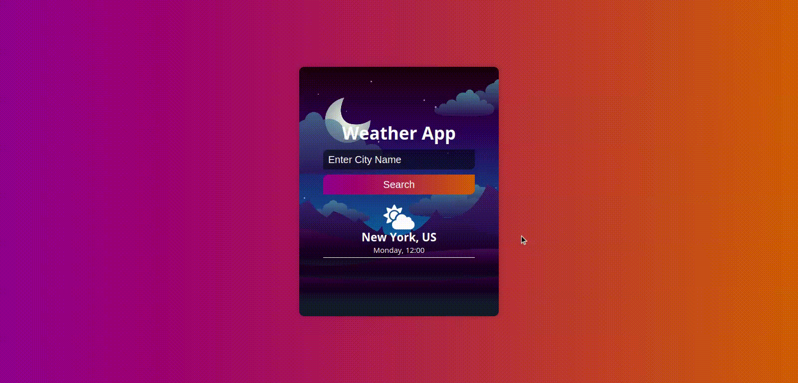

# Weather App

This is a simple weather app that uses the OpenWeatherMap API to get the weather data. It uses the geolocation API to get the user's location and then uses the OpenWeatherMap API to get the weather data for that location. It also has a search bar that allows the user to search for a city and get the weather data for that city.

## Screenshots

