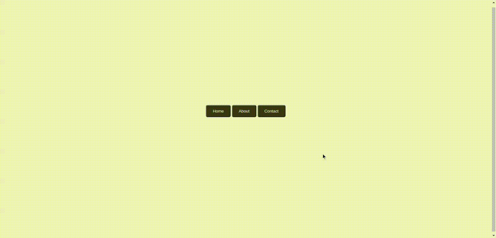

# Data Attribute

The data attribute is used to store custom data private to the page or application. The attributes can then be used in the JavaScript to create a more engaging user experience (without any Ajax calls or server-side database queries).

## Screenshots

